Manual Steps to build the NetFlix application
---------------------------------------

* Install docker
```
sudo apt update
curl -fsSL https://get.docker.com -o install-docker.sh
sh install-docker.sh
sudo usermod -aG docker ubuntu
# exit the server
# and login the server again
docker info

```


* Clone the github repository to the server [Refer Here](https://github.com/rajkumarqt/ProjectsRelated/tree/main/devsecopsproject) for the project repository.
* 
* To build the docker image run the below command
```
docker image build -t <your-image-name>:latest .
```
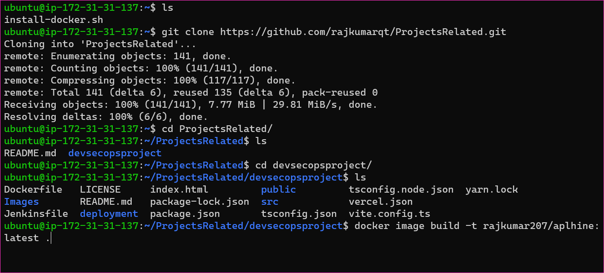

* to create the container based on the image.
```
docker container run -d -P rajkumar207/aplhine
docker image ls
docker container ls
```


* to access the application 
```
http://<public-ip-address>:port-number
```
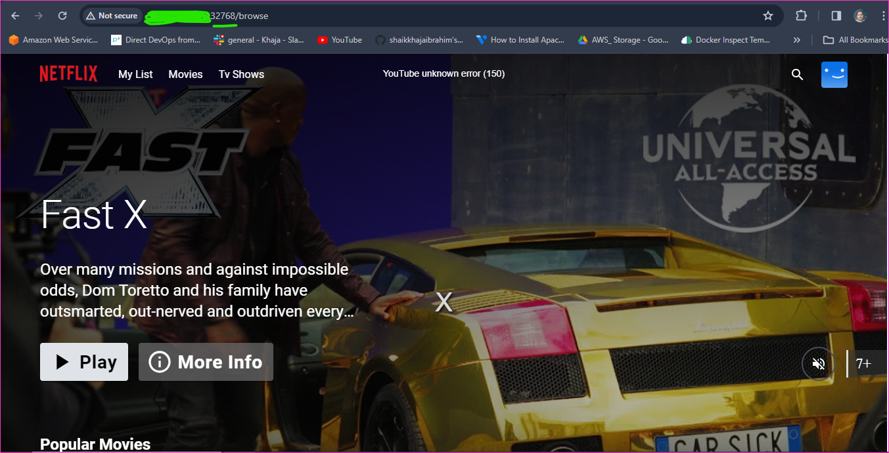


To automate the above Application
----------------------------------
* Prerequisites
    * We need two servers to create the application
    * One is docker and second one is K8S
    * Configure the two servers in jenkins
* We can use jenkins server as a docker slave, otherwise create one more server in AWS console
* Firstly we can create one server name it as jenkins-master in the AWS console

* We need to execute the some commands to the install necessary softwares
* To installing jenkins [Refer Here](https://www.jenkins.io/doc/book/installing/linux/#long-term-support-release) for the official site for  installing jenkins on Linux server

```
sudo apt update
sudo apt install openjdk-17-jdk -y
sudo wget -O /usr/share/keyrings/jenkins-keyring.asc \
  https://pkg.jenkins.io/debian-stable/jenkins.io-2023.key
echo deb [signed-by=/usr/share/keyrings/jenkins-keyring.asc] \
  https://pkg.jenkins.io/debian-stable binary/ | sudo tee \
  /etc/apt/sources.list.d/jenkins.list > /dev/null
sudo apt-get update
sudo apt-get install jenkins -y
``` 

* Complete the jenkins installation and open browser for jenkins web 
```
http://<pub-id-address>:8080
```
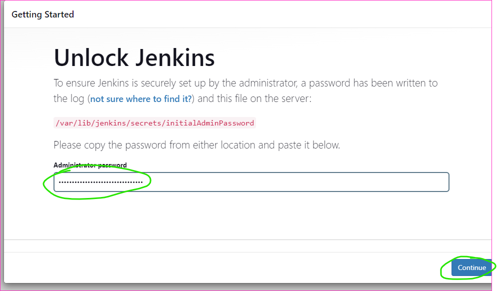
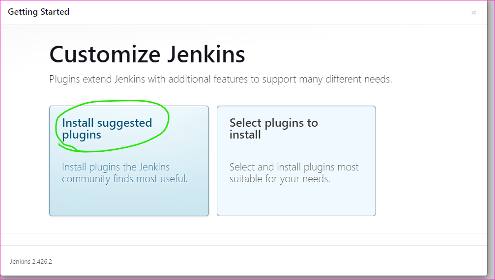


* After that you can start with second instance with name called jenkins-slave-1
* Install some required softwares
```
sudo apt update
sudo apt install openjdk-17-jdk -y
curl -fsSL https://get.docker.com -o install-docker.sh
sh install-docker.sh
sudo usermod -aG docker ubuntu
exit
# relogin the server again
# check the docker info
docker info

# Installing trivy
sudo apt-get install wget apt-transport-https gnupg lsb-release
wget -qO - https://aquasecurity.github.io/trivy-repo/deb/public.key | sudo apt-key add -
echo deb https://aquasecurity.github.io/trivy-repo/deb $(lsb_release -sc) main | sudo tee -a /etc/apt/sources.list.d/trivy.list
sudo apt-get update
sudo apt-get install trivy
```
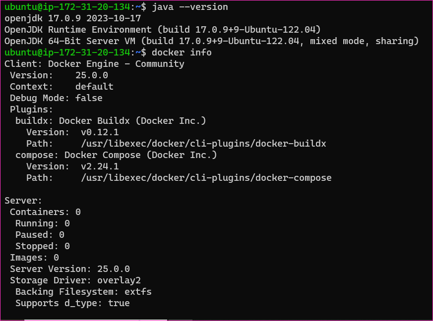

* Next add the node to master in jenkins
* To add the node we need to add global credentials in manage jenkins
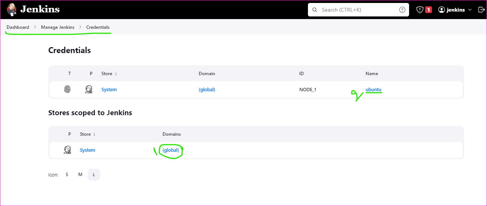
* Add global credentials in new node configuration


* To create new item
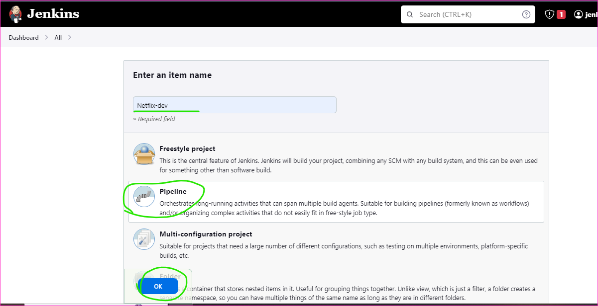
* Add the dockerhub credentials in the plugins in manage jenkins
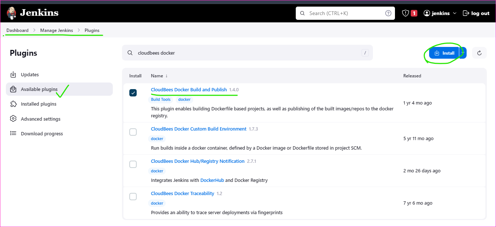
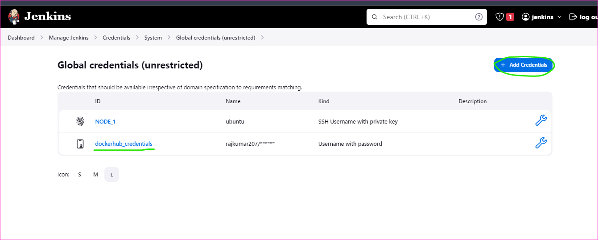
* Installing available plugins for scan the trivy report called HTML Publisher
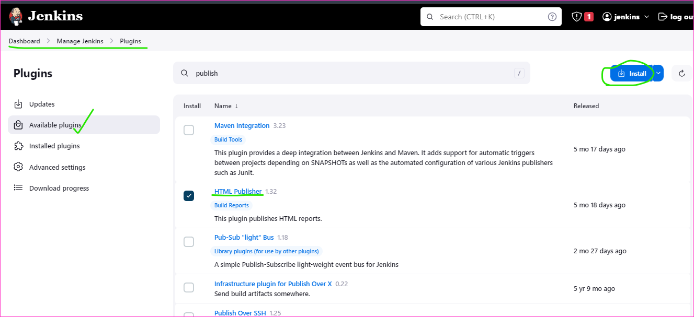


[Refer Here](https://github.com/rajkumarqt/waytodevsecops/blob/main/Jenkinsfile) for the jenkins pipeline code


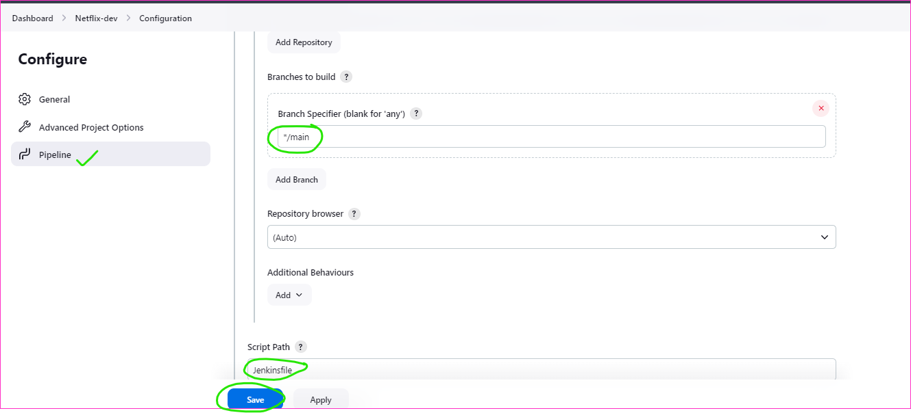
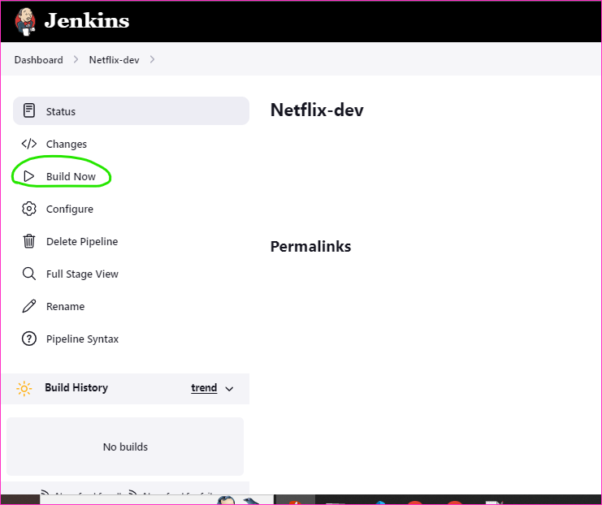
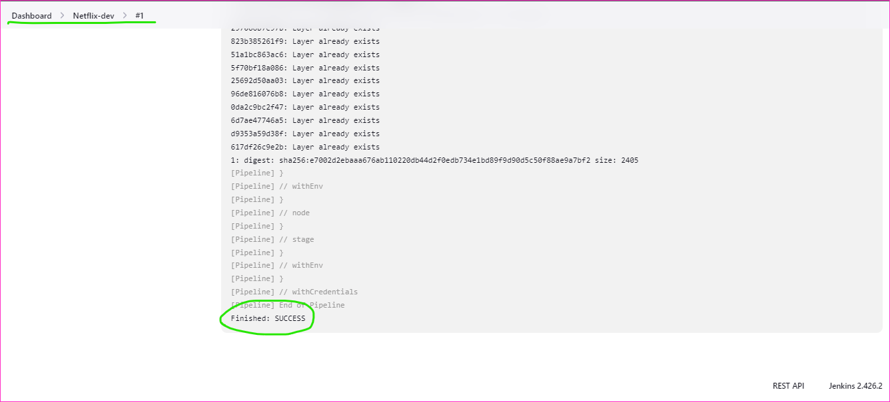


* Create one more instance to create k8s cluster
* Install terraform on the above server
* For that we need to execute some commands to install terraform 
```
sudo apt-get update && sudo apt-get install -y gnupg software-properties-common
wget -O- https://apt.releases.hashicorp.com/gpg | \
gpg --dearmor | \
sudo tee /usr/share/keyrings/hashicorp-archive-keyring.gpg
gpg --no-default-keyring \
--keyring /usr/share/keyrings/hashicorp-archive-keyring.gpg \
--fingerprint
echo "deb [signed-by=/usr/share/keyrings/hashicorp-archive-keyring.gpg] \
https://apt.releases.hashicorp.com $(lsb_release -cs) main" | \
sudo tee /etc/apt/sources.list.d/hashicorp.list
sudo apt update
sudo apt-get install terraform

# Installing kubectl

curl -O https://s3.us-west-2.amazonaws.com/amazon-eks/1.28.5/2024-01-04/bin/linux/amd64/kubectl
curl -O https://s3.us-west-2.amazonaws.com/amazon-eks/1.28.5/2024-01-04/bin/linux/amd64/kubectl.sha256
sha256sum -c kubectl.sha256
openssl sha1 -sha256 kubectl
chmod +x ./kubectl
mkdir -p $HOME/bin && cp ./kubectl $HOME/bin/kubectl && export PATH=$HOME/bin:$PATH
echo 'export PATH=$HOME/bin:$PATH' >> ~/.bashrc
kubectl version --client

# Installing kubescape for scan the code
sudo add-apt-repository ppa:kubescape/kubescape
sudo apt update
sudo apt install kubescape

# Installing aws cli 
sudo apt install unzip -y
curl "https://awscli.amazonaws.com/awscli-exe-linux-x86_64.zip" -o "awscliv2.zip"
unzip awscliv2.zip
sudo ./aws/install
```
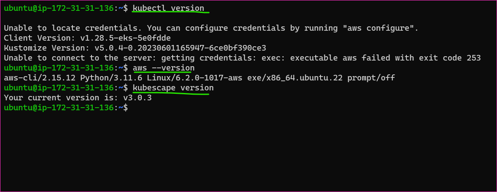

* Adding AWS credentials to the pipeline

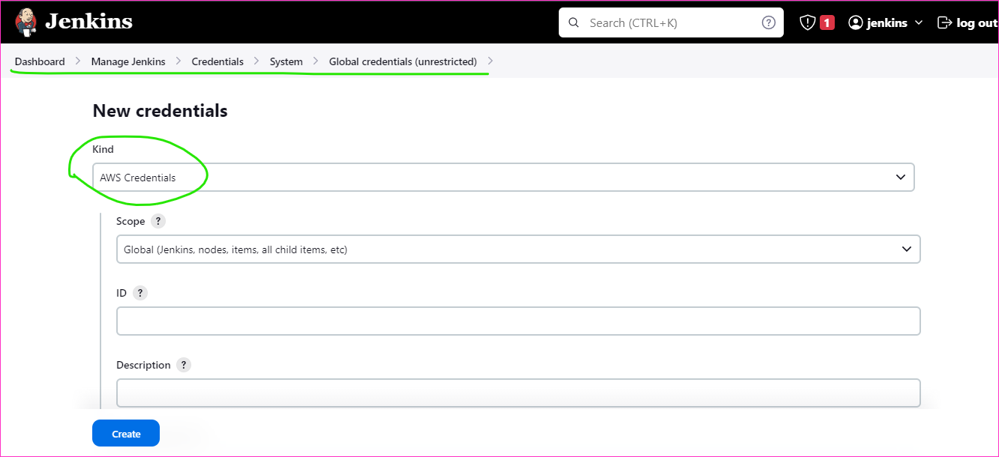
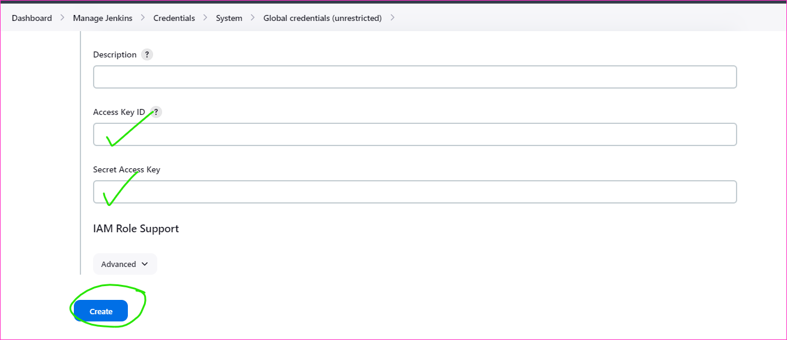

* It will shows the error because of the kubectl version is 1.28, so we can again install kubectl 1.27 and try again build now
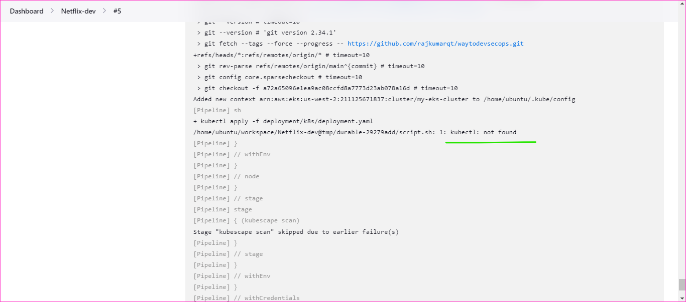
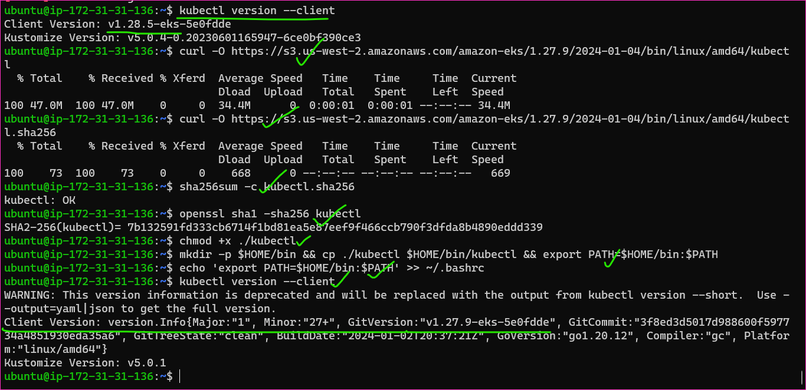

* Final result is here


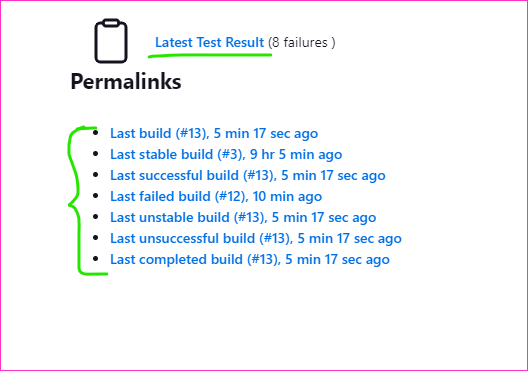

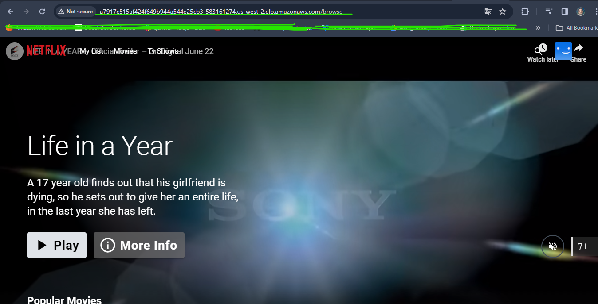


* `NOTE: don't forget to delete the cluster`

